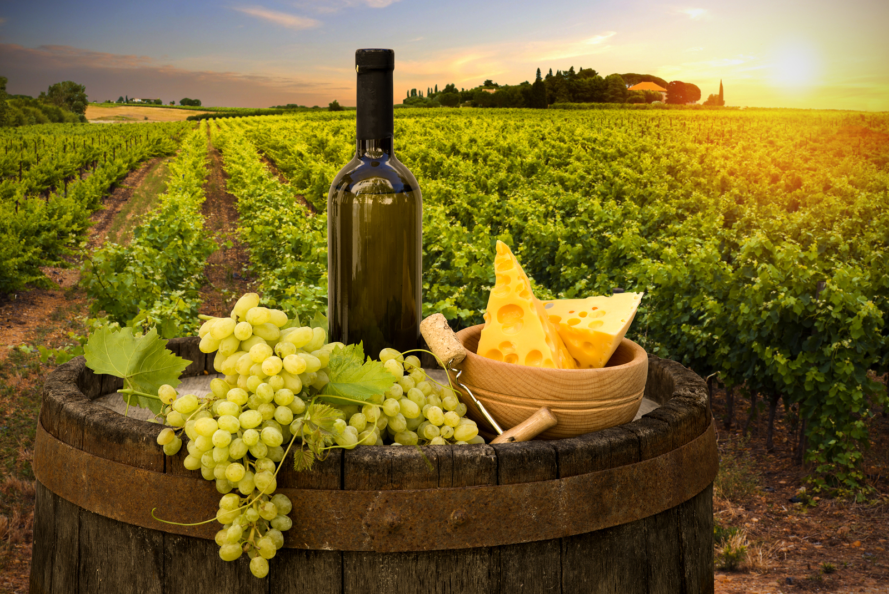

## *Exploring Factors Associated with Professional Wine Reviews*

**[Zhourong Li (zl2977)](https://bluedenw.github.io), [Yubei Liang (yl4606)](https://yubei-yl4606.github.io/yl4606.github.io), [Leo Liu (ll3452)](https://leooolzh.github.io), [Cong Zhang (cz2612)](https://congzhang63.github.io), [Ruwen Zhou (rz2530)](https://carmenzhou.github.io/rz2530.github.io)**

 

## *Demostration Video*
<iframe width="800" height="500" src="https://www.youtube.com/embed/LXroCQ00w-I" frameborder="0" allowfullscreen></iframe>

 

## *Introduction*

 
Wine is an essential component in western food culture. Due to the variety of wine brands, people may easily get lost. Therefore, we would like to provide a review of wines by professional wine tasters and guidance for wine lovers based on variety, location, winery and price. Wine lovers can select and buy wines more easily with information provided on our website.

 

## *Data*

 
This wine [dataset](https://www.kaggle.com/zynicide/wine-reviews) contains 13 columns, including country, designation(the vineyard within the winery where the grapes that made the wine are from), points(the number of points WineEnthusiast rated the wine on a scale of 1-100), price, province, region_2, region_2, variety(the type of grapes used to make the wine), winery(the winery that made the wine).
 

* **country:** The country that the wine is from.

* **description:** A few sentences from a sommelier describing the wine's taste, smell, look, feel, etc.

* **designation** The vineyard within the winery where the grapes that made the wine are from.

* **points** The number of points WineEnthusiast rated the wine on a scale of 1-100 (though they say they only post reviews for wines that score larger than 80).

* **price** The cost for a bottle of the wine.

* **province** The province or state that the wine is from.

* **region_1** The wine growing area in a province or state (i.e. Napa).

* **region_2** Sometimes there are more specific regions specified within a wine growing area (i.e. Rutherford inside the Napa Valley), but this value can sometimes be blank.

* **variety** The type of grapes used to make the wine (i.e. Pinot Noir).

* **winery** The winery that made the wine.

In regression, we import a supplemental continent [dataset](https://datahub.io/JohnSnowLabs/country-and-continent-codes-list) which contains 6 columns. In this project, we will use only Continent_Name and Country_Name to categorize wine dataset by continent. 

* **Continent_Name** Name of the continent.

* **Country_Name** Name of the country.

 

## *Some Interesting Facts about Wines!*

 * Only the United States and France produce wines with prices over $2000.
* The cheapest wine in only 4 dollars!
* Italy is the country that owns the most full-credit wines in the world.

