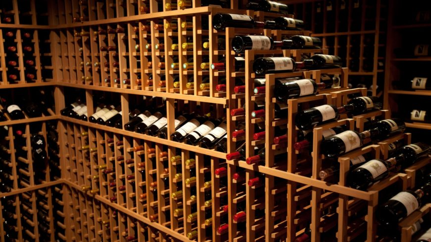

 

# Summary Visualization

In this part, we try to analyze our data and visualize them for better understandings. The data is filtered based on different scales, including continent, countries, cities and even areas. Since the amount of data is large, we have separated the data based on regions. We have analyzed and plotted graphs from the scale of globe, continents and countries.

We first plotted the average wine Points of Countries Around the Globe and around the Europe. From the graphs, we can find out which country has the highest average wine ranking points and which has the lowest. In general, European countries have higher average wine rankings than Asian countries. Then we analyzed the winery by plotting boxplot. We can see not only the average point of wines a winery made, but also its median, q1, q3 and range. Some wineries have more stable outputs than the others. The ranking histogram indicates that the distribution of rankings of wines is close to normal distribution. Another variable that is important when we are choosing wines is the variety of grapes. The taste of wine, on a great extent, depend on the grapes it chooses. Therefore, we have ranked the most preferred grape types used by different wineries.

 

# Statistical Analysis

In this analysis, we are interested in whether wine would be more expensive if its points increases, adjusting for categorical variables variety and continent of production. 

### Log Transformation

We detect a highly skewed pattern of the price distribution, thus our response variable Price needs to be log transformed before fitting into the regression model. After log transformation, the distribution becomes much more normal.

### Modeling

Here, we try to fit a final model in the following form:

$$ log(Price) = \beta_1 + \beta_2X_{Points} + \beta_3X_{Variety} + \beta_4X_{Continent}$$

For predictor Variety, we select the top four types of grapes for simplicity. 

`Question: Should we include interaction term Points * Variety?` 

After log-transforming of independent variable Price, we observe a linear trend in Log_Price vs. Points. This implies a positive correlation between Price and Log_Points. The trend lines for the 4 most frequent varieties are very close together. So there is a similar positive correlation between price and points for each variety. We also observe that lines of Cabernet Sauvignon and Chardonnay cross with each other. However, because $R^2$ does not change significantly before and after adding the interaction term, we decide to remove Points * Variety form the final model. 

`Question: Is Continent a significant predictor variable?`

By doing an ANOVA test, we find that p-value equals to zero, which tells us that the larger model **Log_Price ~ Points + Variety + Continent** is superior over **Log_Price ~ Points + Variety**, which means continent is a significant variable. Therefore, we get the following complete model :

$$ log(Price) = -6.656 + 0.113Points + 0.278Pinot Noir +0.248Cabernet Sauvignon + 0.059Red Blend$$

$$ - 0.341Africa - 0.049Asia + 0.089 Europe - 0.241Oceania -0.411SouthAmerica$$
Based on the summary table of estimates, we see that all of our main effects are statistically significant except in Asia. This indicates that different groups in variety and continent indeed affect the price of a bottle of wine. However, in Asia, price of wine is not affected by points and variety. Since p-value of points estimate is close to zero,  wine would be more expensive if its points (X1) increases, adjusting for categorical variables variety (X2) and continent of production (X3), as we proposed in the hypothesis. Since our $R^2$ value is 0.429, which indicated that chosen variables together are able to explain 42.9% of observed variation in price. Therefore, a moderate association has been observed. 

### Stratified Analysis by Continent

Main Findings:

* For all continents, since the estimates of points are positive, price increases as points increases adjusting for variable variety. It corresponds to our hypothesis that wine is more expensive as its points review increases.

* In Europe only, Carbernet Sauvignon and Red Blend have negative estimates. It implies that the expected price of variety Carbernet Sauvignon and Red Blend in Europe are lower than the expected price of Chardonnay (adjusting for points). This could be resulted by high yields of specific varieties, which lower the price of wine. And we need to do more research on the yields for further analysis.

* Asia has the smallest estimate of points. So the price of wine in Asia is leastly affected by its points, adjusted for variety. In explain, on average, one point increase of wine in Asia leads to 8.5% increase in expected price, which is only one-third of the increase 19.1% in Europe.

### Profound Analysis: Bootstraps for North America

To ensure accuracy, we examined the assumptions of our model for North America. Non-random distribution of variances of residual tells us that bootstrapping needs to be down before fitting the model for price of wine in North America. Therefore, we do bootstrap for 1000 times. Then, we get an almost 17 percent decrease (0.007 to 0.006) in standard error of Pinot Noir estimate, which gives us more accurate confidence interval when predicting the range of price by change of variety. Therefore, the estimated price range of Pinot Noir in North America becomes narrower after bootstraps.

 

# Interactive Map

### Motivation

Nowadays, there are too many wines produced from too many different countries and by too many wineries, buyer/reviewer/enthusiast find it extremely difficult to obtain wine information from one specific country, within in a reasonable price range, and with preferred rating. The interactive Shiny Dashboard could helps us effective get the wine information we want.

### Introduction

The interactive Dashboard is implemented with ShinyApp. The dashboard contains an interactive world map, an interactive box plot and an interactive bar chart. The aim of this dashboard is to effectively help wine buyer/reviewer/enthusiast find the countries of wine origin they preferred.

User can interact with the map, box plot and bar chart by selecting the price range they want, the continent of origin they preferred and the single rating they like. The map and the plots would then change accordingly and provide updated information.

### Details of the Shiny Dashboard

When user clicked on one country, the click label would provide four information: the price range of the wines in this country, the average rating of wines in this country and the number of wines recorded in this country. 

The box plot shows the the price distribution by countries, with median, first quarter (Q1) and the third quarter(Q3), min and max information. The bar chart shows the number of records by countries, it will rank the number of records from high to low.

Hope you enjoy the interaction with the wine information Shiny Dashboard!

